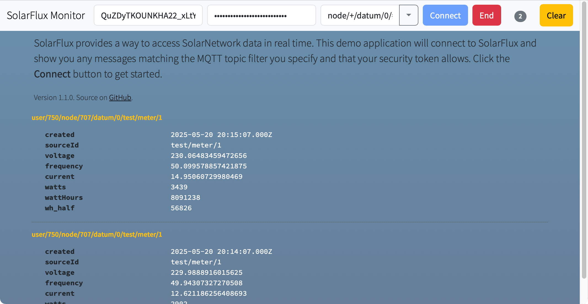

# SolarFlux Demo UI

This project contains a demo webapp called SolarFlux Monitor that shows how to connect to
[SolarFlux][solarflux-api] and consume real-time messages posted there.



# Use

Fill in a valid SolarNetwork security token and secret. Optionally tweak the topic pattern if you
like, i.e. to narrow the nodes and/or sources the app subscribes to. Then

Topics follow this syntax:

```
node/N/datum/0/S
```

where `N` is a _node ID_ and `S` is a _source ID_. The `0` in the topic represents the _raw_
aggregation level, which is level SolarNode posts datum messages at. Example topics look like:

```
node/1/datum/0/Meter
node/2/datum/0/Building1/Room1/Light1
node/2/datum/0/Building1/Room1/Light2
```

**Note** that any leading `/` in a source ID is stripped from the topic name.

By default, the topics that get subscribed to will be automatically re-written by SolarFlux to
include a `user/U` prefix, where `U` is the SolarNetwork _user ID_ of the authenticated user. That
means that the example topics above will result in topics like the following actually being
consumed:

```
user/123/node/1/datum/0/Meter
user/234/node/2/datum/0/Building1/Room1/Light1
user/234/node/2/datum/0/Building1/Room1/Light2
```

# Building from source

To build yourself, clone or download this repository. You need to have
Node 20.19+ installed. Then:

```sh
# initialize dependencies
npm ci

# run development live server on http://localhost:8080
npm run dev

# build for production
npm run build
```

Running the `build` script will generate the application into the `dist/` directory.

[npm]: https://www.npmjs.com/
[solarflux-api]: https://github.com/SolarNetwork/solarnetwork/wiki/SolarFlux-API
