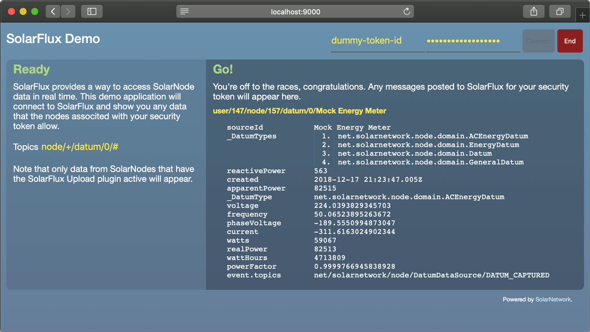

# SolarFlux Demo UI

This project contains a demo webapp that shows how to connect to SolarFlux and consume real-time
datum updates posted there.



# Use

Fill in a valid SolarNetwork security token and secret. Optionally tweak the topic pattern if you
like, i.e. to narrow the nodes and/or sources the app subscribes to. Then 

Topics follow this syntax:

```
node/N/datum/0/S
```

where `N` is a _node ID_ and `S` is a _source ID_. The `0` in the topic represents the _raw_
aggregation level, which is level SolarNode posts datum messages at. Example topics look like:

```
node/1/datum/0/Meter
node/2/datum/0/Building1/Room1/Light1
node/2/datum/0/Building1/Room1/Light2
```

**Note** that any leading `/` in a source ID is stripped from the topic name.

By default, the topics that get subscribed to will be automatically re-written by SolarFlux to
include a `user/U` prefix, where `U` is the SolarNetwork _user ID_ of the authenticated user. That
means that the example topics above will result in topics like the following actually being
consumed:

```
user/123/node/1/datum/0/Meter
user/234/node/2/datum/0/Building1/Room1/Light1
user/234/node/2/datum/0/Building1/Room1/Light2
```


# Building

The build uses [NPM][npm] or [Yarn][yarn]. First, initialize the dependencies:

```shell
# NPM
npm install

# or, Yarn
yarn install
```

Then, the development web server can be started via

```shell
# NPM
npm run start

# or, Yarn
yarn run start
```

and then the app can be reached at [localhost:9000](http://localhost:9000). For a
produciton build, use

```shell
# NPM
npm run build -- --config webpack.prod.js

# or, Yarn
yarn run build --config webpack.prod.js
```

and the app will be built in the `dist` directory.


[npm]: https://www.npmjs.com/
[yarn]: https://yarnpkg.com/

